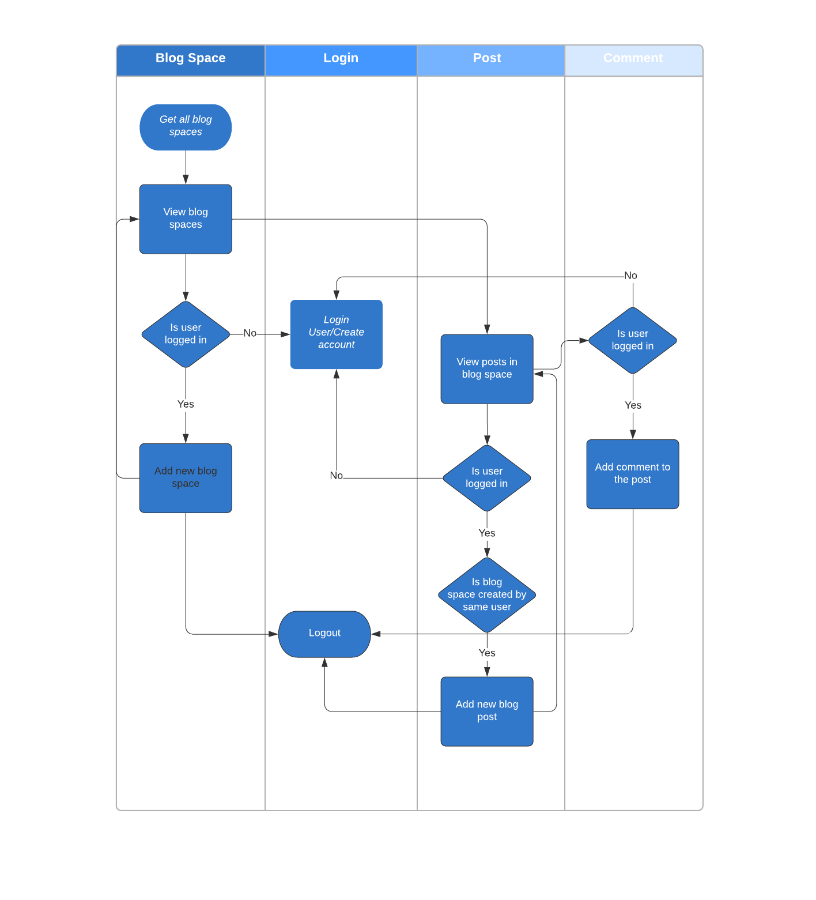
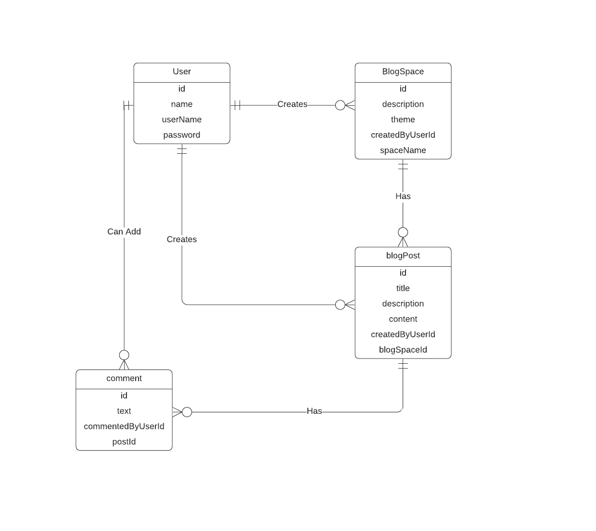

#Adobe Blog Engine

## Content

* [Setup](#setup)
* [Features](#features)
* [Tests](#tests)
* [Swim Lane Diagram](#swimLane)
* [ERD Diagram](#erdDiagram)
* [Acknowledgements](#ack)

## Setup

* Backend server
  * I have used spring boot with h2 database to run the backend.
  * First, please run maven clean install to install the dependencies needed to run the project.
  * Post that please run the BlogApplication.java class located in the src folder to start the server.
  * This will start the server at localhost:8081  

* Front end server
    * I have used ReactJs to build the front end.
    * cd into the web folder from the main folder.
    * Run npm install to install all the dependencies used by the project.
    * run npm start to start the front end server, this should start the app at localhost:3000 

I have pre-populated the database with some dummy users, blog spaces and comments.
To login you can use the following credentials - userName - user1, password - userPassword (case sensitive)
I have used h2 database to store the in session data, as I did not want reviewer to go through the process of setting up the database.
Due to this, once the app is shutdown, the data would be lost, for actual apps I would connect to another database server which would
retain the data once the server shuts down.
     
 ## Features
* In the app first the user can see the blog spaces available.
* The anonymous user can view posts within each blog space and the content of the post but cannot view/ add comment to the post.
* Once the user logs-in or creates an account he can add a new blog space. View posts in the blog space and add a new post if the same user created that blog space.
* User can also view/ add comments to the blog posts.
* The blog spaces are themed (Dark / Light) as per the theme selected when creating the space, the posts in the space reflect the theme.

## Tests
* Junit tests
    * I have added junit tests for the service and controller classes written.
* 
    * I have added react tests under the \_\_test\_\_ folder inside web. You can run the test using npm test.
  
## Swim  Lane Diagram

## ERD Diagram
     
  
  
## Acknowledgements
* I have created the front end using [create-react-app](https://reactjs.org/docs/create-a-new-react-app.html)
* Initialized spring boot application using [spring initializer](https://start.spring.io/)
* Used [react-responsive-grid](https://github.com/STRML/react-grid-layout) to show all the blog cards
* Wrote react tests using [enzyme](https://enzymejs.github.io/enzyme/).

